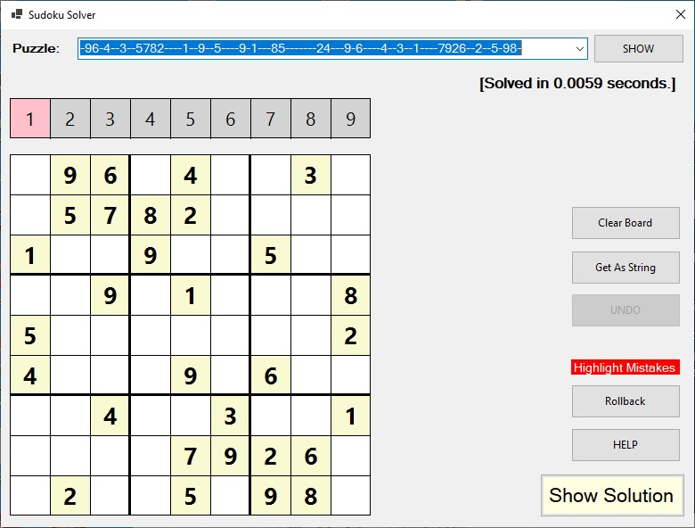

# A Sudoku Solver Library #

This repo contains the code for a Sudoku Solver library.

<br>

The Sudoku solution consists of the following projects:

- **SudokuLib**: The code for the Sudoku Solver library itself.
- **SudokuConsoleApp**: A console application that demonstrates the use of the library.
- **SudokuWinFormsApp**: A rather ugly WinForms application that displays Sudoku puzzles, uses the Sudoku Solver library to solve them, and allows the user to complete them.

<br>

### Prerequisites

- [.NET Core 3.1 SDK](https://www.microsoft.com/net/download/core)
  
<br>

### Usage

Add a reference for the SudokuLib DLL to your project, and the following `using` to the top of your .cs file:

```csharp
	using PendleCodeMonkey.SudokuLib;
```

The Sudoku Solver functionality can then be invoked as follows:

```csharp
	Sudoku sudoku = new Sudoku();

	string puzzle = "-96-4--3--5782----1--9--5----9-1---85-------24---9-6----4--3--1----7926--2--5-98-";
	sudoku.InitializeBoard(puzzle);

	var (valid, solved, solution) = sudoku.Solve();
```

This code creates a new instance of the `Sudoku` class, initializes the puzzle with a string that represents the puzzle layout, and invokes the `Solve` method to attempt to find a solution to the puzzle.  
The `Solve` method returns a tuple containing the following values:

| Value | Description
|---:| ---
| valid | A boolean value - `true` if the supplied puzzle string was valid; otherwise `false`.
| solved | A boolean value - `true` if a solution was found for the supplied puzzle; otherwise `false`.
| solution | A string containing the solved puzzle layout (but obviously only when a solution was found).

<br>

The string that is used to initialize the puzzle (and also the solution string that is returned by the Solve method) should contain 81 characters (one for each of the 81 squares on the Sudoku puzzle) with
the first character corresponding to the top left square on the puzzle, and then working left to right along each row (from the top row down to the bottom row) until the last character (which corresponds
to the square in the bottom right corner of the puzzle).  
In the initialization string, a dash '`-`' is used to represent an empty square at the corresponding position on the puzzle.

<br>

## The SudokuWinFormsApp application

The SudokuWinFormsApp WinForms application displays Sudoku puzzles initialized using a string (as described above), uses the SudokuLib component to find a solution, and then allows the user to complete the puzzle themselves.  
The UI for this application is shown below:



<br>
<br>

The initialization string should be entered into the text control at the top of the form and the '`SHOW`' button clicked to display the puzzle. At this point the application invokes the SudokuLib component to attempt to find a solution (displaying the amount of time it took to solve the puzzle or a message indicating that a solution could not be found).  
The row of numbers (1 to 9) above the puzzle display allows the user to select the digit that will be entered when clicking on an empty square; e.g. in the above screenshot, the number `1` is currently selected; therefore, clicking on an empty square with the left mouse button will add a number `1` in that square). clicking on the number `2` in the row of numbers above the puzzle will cause the number `2` to be selected and then subsequently clicking on an empty square in the puzzle will add a number `2` in that square.  
Clicking on one of the white squares in the puzzle (i.e. a square that was not filled with a number when the puzzle was initialized) with the right mouse button will remove any number that has previously been added to that square.  
When the puzzle has been successfully completed, the display (showing the amount of time it took for the SudokuLib component to solve the puzzle) is replaced with a "PUZZLE COMPLETED" message.  
<br>
The puzzle can be completely cleared at any point by clicking the '`Clear Board`' button.  
The '`Get As String`' button can be clicked to get a string representation of the current puzzle layout (which is then put into the text control at the top of the form) - this can be useful for building your own puzzle layouts... simply start with a cleared puzzle, build up the Sudoku puzzle with the '`known`' numbers in their correct positions, click the '`Get As String`' button to get the string representation in the text control (which can then be copied/pasted, etc.). Clicking the '`SHOW`' button will then display the puzzle (with the '`known`' numbers in cream coloured squares) and SudokuLib will attempt to solve that puzzle.  
The application keeps a history of the changes made to the puzzle and clicking the '`UNDO`' button will undo the last change that was made.  
Clicking (and holding down the left mouse button) on the '`Highlight Mistakes`' button will cause a red square to be shown around every square on the puzzle that currently contains an incorrect number. This can be helpful if you suspect you've made a mistake somewhere whilst trying to complete a puzzle.  
The '`Rollback`' button can be clicked when you have made mistakes whilst trying to solve a puzzle and will return your puzzle back to the last correct state (i.e. the puzzle layout at the last time there were no incorrect entries).  
Clicking the '`HELP`' button toggles the application into and out of Help mode; when in this mode, left-clicking on a square in the puzzle will cause the correct value to be entered into that square (helpful if you're struggling to work out which number should be entered into a certain square).  
Finally, clicking the "`Show Solution`' button will complete the puzzle (showing the solution that was found by the SudokuLib component).
<br>
<br>
The SudokuWinFormsApp WinForms application attempts to read Sudoku puzzles from a file called "`sudokus.txt`" whenever one is located in the same folder as the application itself. This file should contain the puzzle initialization strings (as outlined above) with one line in the text file per puzzle.  
A sample "`sudokus.txt`" file is included in the root of this repo. Simply copy this file into the folder containing the SudokuWinFormsApp WinForms application (prior to running the app) and the drop-down text control at the top of the UI will then contain a list of available puzzles.  
If no "`sudokus.txt`" file is found then the application will have just one in-built puzzle. You can of course type in your own initialization strings.